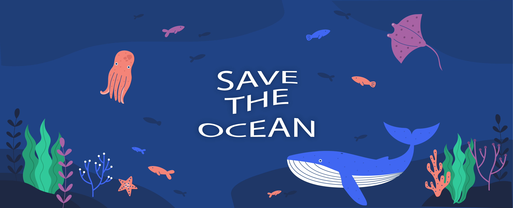

# WWDC 2022

[ACCEPTED] Submission for WWDC2022

Steps to play with the playground:
1. Download and unzip the file
2. Open SavetheOcean.swiftpm with Xcode
3. You will see each Page to play
4. Run the code in XCode
5. You can click in the picture of each animal to see the information
6. You can click to remove the garbage to save the ocean
7. Have fun!
 
---

# It time to SAVE THE OCEAN! 🐳
 
 This playground aims to transmit a message to protect our ocean in the world.
 
 # My Story
 
 My own project for the WWDC 2022 Student Swift Challenge is Save the Ocean. For a long time, the sea and ocean have had a special place in my heart. I used to go to the beach with my friends, sit and watch the sunset, and eat barbecue there throughout my childhood. The sea and ocean were significantly different a decade ago than they are now. The ocean was clean, and fish and other sea creatures coexisted peacefully with people. The water has been considerably polluted in recent years, and certain aquatic animals are on the edge of extinction. Witnessing such things makes me very sad as someone who is attached to the sea. Because of that reason, I choose my topic in my playground app to be related to the ocean. 
 
## Enjoy and Have Fun 🥳
 
Nice to see you today. I hope this help you to understand the important of sea to our life.

# Credits and Thanks 🙏
All images are permitted to be used in this project. Special thanks to Zaplash for free music.
Free vector from Freepik.com 
## Sources I collect information from:
 -[Whale](https://www.worldwildlife.org/stories/whales-and-the-plastics-problem/)
 -[Octopus](https://www.forbesindia.com/article/lifes/octopuses-are-taking-refuge-in-plastic-waste/74399/1)
 -[Stingray](https://www.express.co.uk/news/nature/731351/Giant-stingray-found-Cambodia-Mae-Klong-polluted-river-poachers-fishermen/)
 
 -[Dolphin](https://savedolphins.eii.org/news/dangers-to-whales-and-dolphins-from-plastic-pollution-in-the-ocean1/)
 -[Turtle]
  (https://www.worldwildlife.org/stories/what-do-sea-turtles-eat-unfortunately-plastic-bags#:~:text=Sharp%20plastics%20can%20rupture%20internal,lead%20to%20slow%20reproduction%20rates.
 -[Seahorse](https://www.4ocean.com/blogs/blog/small-but-mighty-seahorses)

 -[JellyFish](https://hakaimagazine.com/news/in-the-future-jellyfish-slime-may-be-the-solution-to-microplastic-pollution/)
 -[Shark]
    (https://www.greenpeace.org/usa/news/research-shows-that-67-of-sharks-are-contaminated-with-plastic/#:~:text=Research%20shows%20that%2067%25%20of%20sharks%20are%20contaminated%20with%20plastic,-by%20Perry%20Wheeler&text=London%2C%20UK%20%E2%80%93%20A%20study%20from,fiber%20in%20their%20digestive%20system)

 -[ClownFish](https://earth.org/clownfish-unable-to-adapt-to-the-climate-crisis-scientists-say/)
 -[Crab]
    (https://www.bbc.com/news/uk-england-humber-58160697#:~:text=A%20University%20of%20Hull%20study,by%20food%20sources%20during%20decomposition)
 
 -[PufferFish](http://pufferfishfacts.weebly.com/dangers.html)
 
 ## Image Source:
 -​​ https://www.pinterest.co.uk/pin/113715959314472266/
 - https://www.pinterest.co.uk/pin/113715959314472266/
 -https://files.worldwildlife.org/wwfcmsprod/images/MAIN_Plastic_pollution_Alex_Mustard_WW1127424/blog_show/o07iq02i8_Medium_WW1127424.jpg
 - https://www.dailymail.co.uk/sciencetech/article-7213813/The-Great-White-shark-humbled-plastic-pollution.html
 - https://earth.org/clownfish-unable-to-adapt-to-the-climate-crisis-scientists-say/
 - https://live.staticflickr.com/4614/38781245140_bc5ff97f70_b.jpg
 - http://pufferfishfacts.weebly.com/dangers.html
 - Pinterest Source
 
 ## Tutorial:
   - [Developing Apps for iOS Course](https://cs193p.sites.stanford.edu) for ideas about implementation
   - [Hacking with Swift](https://www.hackingwithswift.com/) for SwiftUI tips
 
 
